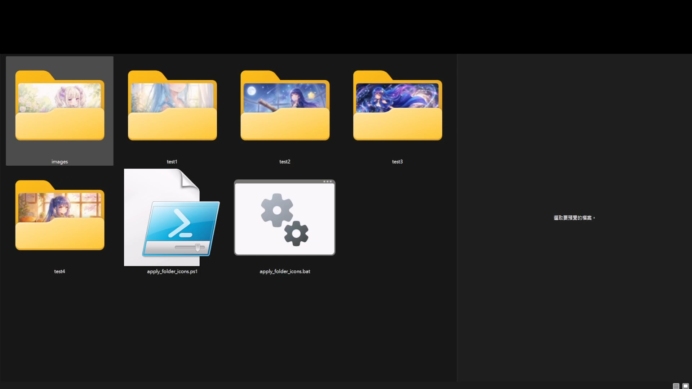
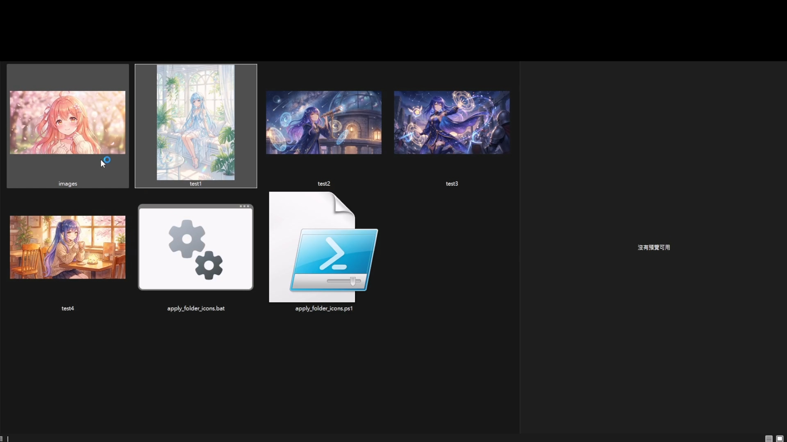

# apply_folder_icons

> 為每個第一層子資料夾自動套用自訂資料夾圖示。  
> Automatically apply custom folder icons to each first-level subfolder.

## 效果預覽 | Preview


| 套用前 / Before | 套用後 / After |
|---|---|
|  |  |

## 簡介 | Overview

### 繁體中文
這是一個 Windows 專用的小工具，會掃描腳本所在目錄下的**第一層子資料夾**，從每個子資料夾的**根目錄**中找出第一張圖片，將其轉成 `.ico`，並寫入 `desktop.ini` 來套用資料夾圖示。

這個專案適合用在：
- 漫畫、插畫、相簿或素材資料夾整理
- 本地媒體庫、專案資料夾美化
- 想快速替大量資料夾套用封面圖示的情境

### English
This is a small **Windows-only** utility that scans the **first-level subfolders** under the script directory, finds the first image in the **root of each subfolder**, converts it into an `.ico` file, and writes a `desktop.ini` file so Windows Explorer uses it as the folder icon.

This project is useful for:
- organizing manga, artwork, photo, or asset folders
- beautifying local media libraries or project folders
- quickly applying cover-style folder icons in bulk

## 功能特色 | Features

### 繁體中文
- 掃描腳本所在目錄下的第一層子資料夾
- 只使用各子資料夾根目錄中的圖片，不會遞迴搜尋
- 支援 `jpg`、`jpeg`、`png`、`webp`、`bmp`
- 自動產生 `foldericon_<hash>.ico`
- 自動清理舊的 `foldericon_*.ico` 與舊版 `foldericon.ico`
- 自動寫入 `desktop.ini`
- 自動設定隱藏 / 系統屬性
- 最後重新啟動 Explorer 以刷新圖示快取，並嘗試重新開啟原本的檔案總管視窗

### English
- Scans first-level subfolders under the script directory
- Uses only images in each subfolder root; no recursive search
- Supports `jpg`, `jpeg`, `png`, `webp`, and `bmp`
- Automatically generates `foldericon_<hash>.ico`
- Automatically cleans old `foldericon_*.ico` files and legacy `foldericon.ico`
- Automatically writes `desktop.ini`
- Automatically applies hidden / system attributes
- Restarts Explorer at the end to refresh the icon cache and attempts to reopen previously open Explorer windows

## 系統需求 | Requirements

### 繁體中文
- Windows Explorer
- PowerShell（透過 `apply_folder_icons.bat` 可直接執行）
- `.NET` 的 `System.Drawing`

### English
- Windows Explorer
- PowerShell (can be launched directly through `apply_folder_icons.bat`)
- `.NET` `System.Drawing`

## 使用方式 | Usage

### 繁體中文
1. 將 `apply_folder_icons.bat` 與 `apply_folder_icons.ps1` 放在你的目標資料夾父層。
2. 確認每個要處理的子資料夾，其**根目錄**至少有一張圖片。
3. 雙擊執行 `apply_folder_icons.bat`。
4. 等待腳本完成；執行結束後 Explorer 會重新啟動以刷新圖示。

你也可以直接用 PowerShell 執行：

```powershell
powershell -NoProfile -ExecutionPolicy Bypass -File .\apply_folder_icons.ps1
```

### English
1. Place `apply_folder_icons.bat` and `apply_folder_icons.ps1` in the parent directory that contains your target subfolders.
2. Make sure each target subfolder has at least one image in its **root directory**.
3. Double-click `apply_folder_icons.bat`.
4. Wait for the script to finish; Explorer will restart at the end to refresh the icons.

You can also run it directly with PowerShell:

```powershell
powershell -NoProfile -ExecutionPolicy Bypass -File .\apply_folder_icons.ps1
```

## 範例結構 | Example Layout

```text
YourRoot/
├─ apply_folder_icons.bat
├─ apply_folder_icons.ps1
├─ Folder A/
│  ├─ cover.jpg
│  └─ other-file.txt
├─ Folder B/
│  └─ preview.png
└─ Folder C/
   └─ image.webp
```

## 處理規則 | Processing Rules

### 繁體中文
- 只處理腳本所在目錄下的**第一層子資料夾**
- 只會搜尋各子資料夾**根目錄**中的圖片
- 會依檔名排序後取**第一張圖片**
- 若該資料夾沒有圖片，會略過
- 會產生 256x256 的 PNG-in-ICO 圖示
- 圖示檔名會包含圖片內容的 SHA-256 前 16 碼，讓圖片內容變更時可更有效刷新快取

### English
- Only the **first-level subfolders** under the script directory are processed
- Only images in each subfolder **root directory** are considered
- The script sorts by file name and uses the **first image**
- Folders without a valid image are skipped
- A 256x256 PNG-in-ICO icon is generated
- The icon file name includes the first 16 characters of the image SHA-256 hash, which helps refresh the cache when the image content changes

## 產出內容 | Generated Files

### 繁體中文
每個成功處理的資料夾中會建立：
- `foldericon_<hash>.ico`
- `desktop.ini`

此外，腳本也會：
- 把 icon 檔與 `desktop.ini` 設為隱藏 / 系統檔
- 將資料夾設為唯讀屬性（Windows 自訂資料夾圖示所需）

### English
Each successfully processed folder will contain:
- `foldericon_<hash>.ico`
- `desktop.ini`

The script also:
- marks the icon file and `desktop.ini` as hidden / system files
- sets the folder to read-only (required by Windows for custom folder icon behavior)

## 注意事項 | Notes & Limitations

### 繁體中文
- **Windows only**：此專案依賴 `desktop.ini`、檔案屬性與 Explorer 行為。
- **會重新啟動 Explorer**：執行完成後工作列與檔案總管會短暫重啟。
- **建議先在測試資料夾試跑**：腳本會修改資料夾與檔案屬性。
- **WEBP 相容性可能依系統而異**：雖然腳本接受 `.webp` 副檔名，但 `System.Drawing` 能否正確讀取仍取決於系統編解碼支援。
- **不會遞迴搜尋子目錄**：如果圖片放在更深層資料夾，腳本不會使用。
- **圖示快取仍可能延遲刷新**：多數情況下重啟 Explorer 即可，但少數系統可能仍需額外等待、重新登入，或手動清除快取。

### English
- **Windows only**: this project depends on `desktop.ini`, file attributes, and Explorer behavior.
- **Explorer will restart**: the taskbar and File Explorer will briefly restart after processing.
- **Test on a sample folder first**: the script changes folder and file attributes.
- **WEBP compatibility may vary**: while `.webp` is accepted by extension, actual `System.Drawing` support depends on system codecs.
- **No recursive search**: images inside deeper subdirectories are ignored.
- **Icon cache refresh may still lag**: restarting Explorer is usually enough, but some systems may still require extra time, sign-out, or manual cache cleanup.

## 授權 | License

### 繁體中文
本專案採用 [MIT License](./LICENSE)。

### English
This project is licensed under the [MIT License](./LICENSE).
